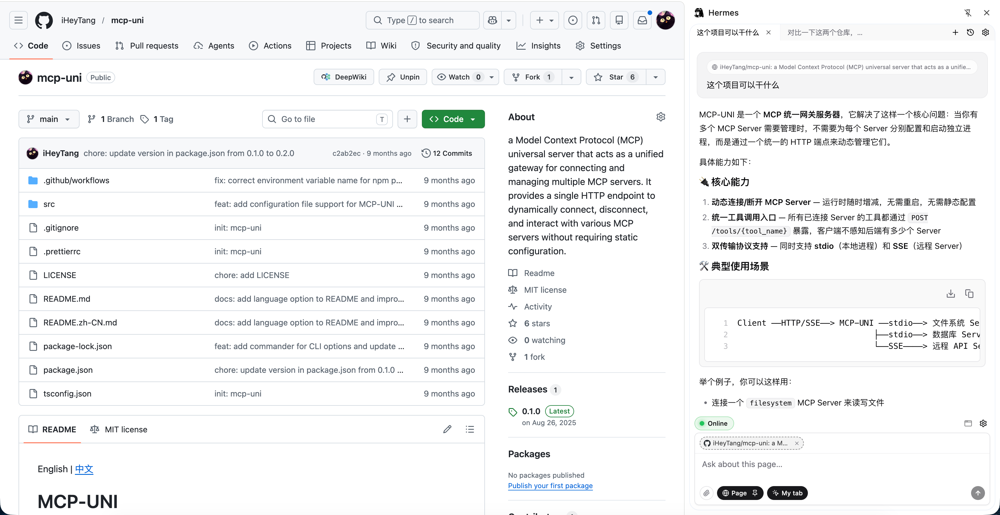
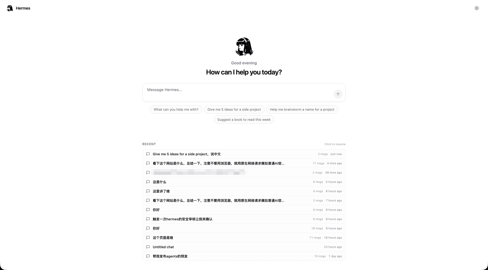
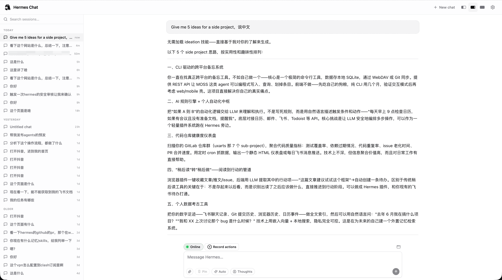

# Hermes Browser Extension

**English** | [简体中文](README.zh-CN.md)

Hermes drives a **separate Chrome window** in your normal profile (no debugging banner, no stealing focus from your working tab). This repo adds a Plasmo extension plus a small Python bridge.

## Prerequisites

This extension is the **frontend** piece of a three-repo stack. You need all
three pieces running for the extension to be useful:

| Repo | What it gives you |
|---|---|
| [hermes-plugin-http-backplane](https://github.com/iHeyTang/hermes-plugin-http-backplane) | Local HTTP server on `127.0.0.1:9394` that this extension talks to (sessions / cron / skills / model config / lifecycle). Without it the extension shows an "offline" onboarding screen. |
| [hermes-plugin-browser-tools](https://github.com/iHeyTang/hermes-plugin-browser-tools) | Hermes-side tools (`my_browser_screenshot`, `my_browser_inbox_*`, etc.) so the agent can drive this extension. Without it, this extension still works but the agent has no browser tools. |
| **this repo** | The Chrome extension (side panel + home page + chat tab + options). |

### Quick install

After [Hermes Agent](https://github.com/NousResearch/hermes-agent) is set up:

```bash
hermes plugins install iHeyTang/hermes-plugin-http-backplane
hermes plugins install iHeyTang/hermes-plugin-browser-tools
hermes chat   # starts Hermes + the backplane HTTP server
```

Then install this extension (see [Install with Hermes](#install-with-hermes-recommended) below). The extension's **Status** tab is the canonical "is everything wired up correctly?" check — green badges = ready to chat.

The extension surfaces Hermes in four places:

- **Side panel** — chat alongside the page you're browsing.
- **Home page** — replaces Chrome's new-tab page with a Hermes launcher (greeting, prompt input, recent sessions).
- **Full-screen chat** — a dedicated chat tab with a sessions rail on the left and an adjustable message column.
- **Options page** — configure the gateway, models, skills, memory, cron jobs, and userscripts.

### Side panel — chat next to your page



### Home page — new-tab launcher



### Full-screen chat — dedicated tab



---

## Inbox — a shared surface across every channel

The new-tab **Inbox** is this extension's answer to a gap in Hermes core:
Hermes can run cron jobs and ferry messages across many channels (Feishu,
Telegram, Slack, …) but it has no built-in way for an agent in *one* channel
to read what produced in *another*. The Inbox fills that gap by acting as a
plugin-owned unified surface — anything that lands here is readable from
both the new-tab UI **and** any Hermes session via three companion tools.

Three independent layers — *Inbox is the aggregator*, not a store:

```
   Independent mechanisms                Aggregator layer        Consumers
   (each owns its own store)              (this plugin)

  ┌─────────────────────────┐                                ┌─────────────────┐
  │ Cron jobs               │                                │ new-tab Home    │
  │  (Hermes core)          │                                │  (renders cards)│
  │                         │                                └─────────────────┘
  │ store: $HERMES_HOME/    │ ──►                                     ▲
  │   cron/output/{job}/    │     ┌──────────────────────┐            │
  │   *.md                  │     │                      │            │
  └─────────────────────────┘     │  Inbox aggregator    │ ───────────┤
                                  │  (this plugin)       │            │
  ┌─────────────────────────┐     │                      │   ┌────────┴────────┐
  │ Agent cards             │ ──► │  - reads all sources │   │ Agent in any    │
  │  (this plugin, peer to  │     │  - unifies into one  │   │ channel         │
  │   cron jobs)            │     │    feed              │   │ (my_browser_    │
  │                         │     └──────────────────────┘   │  inbox_list/    │
  │ write: my_browser_      │                                │  read tools)    │
  │   card_push tool        │                                └─────────────────┘
  │ store: $HERMES_HOME/    │
  │   agent_cards/cards.json│
  └─────────────────────────┘
```

### What goes in

1. **Every cron run, automatically.** Hermes always writes each run's
   markdown to `$HERMES_HOME/cron/output/{job_id}/{timestamp}.md`; the
   extension indexes that directory and folds every run into the Inbox
   regardless of the job's `deliver` setting. The `deliver` field only
   controls *additional* channel pushing (Feishu / Telegram / …) on top
   of the always-on Inbox.
2. **Agent cards** via `my_browser_card_push`. This is an **independent
   mechanism**, conceptually peer to cron jobs and *not* internal to the
   Inbox: anything in the Hermes process — a chat turn, a background
   watchdog, a custom tool — can leave the user a structured card.
   Stored at `$HERMES_HOME/agent_cards/cards.json`. The Inbox is just one
   consumer of this source; future consumers (e.g. a Lark bot doing
   daily digest DMs) could read the same store.

### Agent tools (cross-channel)

Three tools register under the `my-browser-extension` toolset, so a Hermes
session running in any channel can use them once this plugin is enabled:

- **`my_browser_card_push`** — leave the user a structured card
  (headline + tldr + actions + urgency). **This is the agent-cards
  mechanism's writer, not an Inbox-internal API** — the card is stored
  under `$HERMES_HOME/agent_cards/` and the Inbox is one of its
  consumers. Use this proactively when there's something the user should
  know after the fact.
- **`my_browser_inbox_list`** — page through everything in the Inbox.
  Filters: `kind` (cron-result / agent-card / all), `source` substring
  match, `since_ms` cursor, `limit`, `include_silent`. Returns one-line
  previews so a session can decide what's worth opening.
- **`my_browser_inbox_read`** — pull the full body of one entry by id.
  For cron entries this is the complete run markdown; for agent cards
  it's the full synthesis.

Typical use from a Feishu session: "Did anything interesting come out of
this morning's cron jobs?" → agent calls `inbox_list` with a `since_ms`
covering the morning → reads a few entries via `inbox_read` → reports
back. No filesystem access needed; the tools read straight from
`$HERMES_HOME`.

### New-tab UI

The Home page's left column renders the Inbox as a card feed: unread
cards float to the top, errors get an accent border, and clicking a card
opens the full content inline. Cron cards show the verbatim run output
(no truncation, no summary "Hermes Card" coupling); agent-pushed cards
show their structured synthesis.

---

## Install

The extension is **not on the Chrome Web Store** (yet). Sideload it:

1. Visit the [download page](https://iheytang.github.io/hermes-my-browser-extension/)
   (served by GitHub Pages from `docs/index.html`)
2. Download the latest `.zip` (pulled from this repo's
   [GitHub Releases](https://github.com/iHeyTang/hermes-my-browser-extension/releases))
3. Unzip → `chrome://extensions/` → Developer mode → Load unpacked

The matching Hermes plugin (WebSocket hub + tools) lives at
[`iHeyTang/hermes-plugin-browser-tools`](https://github.com/iHeyTang/hermes-plugin-browser-tools)
— install that into Hermes first, then sideload this extension and it
will connect to the local bridge automatically.

## After it is installed

Short guide: [`after-install.md`](./after-install.md)

Technical / packaging details: [`DEVELOPER.md`](./DEVELOPER.md)

## For maintainers

- [`docs/index.html`](./docs/index.html) — the download page (GitHub Pages source)
- [`.github/workflows/release.yml`](./.github/workflows/release.yml) —
  CI: builds + attaches zip to GitHub Releases on `v*` tag push
- [`RELEASE.md`](./RELEASE.md) — release workflow (bump version → tag → CI does the rest)
- [`PRIVACY.md`](./PRIVACY.md) — public privacy policy (linked from the download page)

## Uninstall

```bash
hermes plugins remove hermes-my-browser-extension
"${HOME}/.hermes/hermes-agent/venv/bin/python" -m pip uninstall hermes-my-browser-extension
```

Remove the extension from `chrome://extensions/` as well.

## License

MIT
