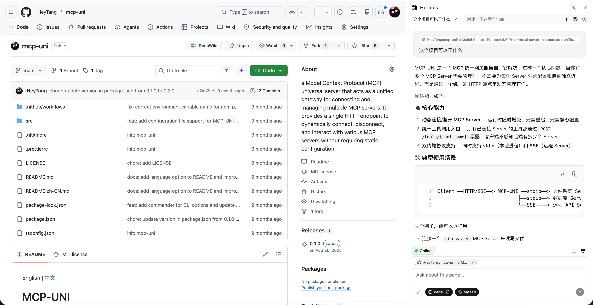

# Hermes Browser Extension

[English](README.md) | **简体中文**

让 Hermes Agent 在你**日常使用的同一个 Chrome 配置（profile）**里操作页面——不需要 `--remote-debugging-port`，不需要重启浏览器，**不会出现「正由自动化测试软件控制」之类的调试条**，也**不会抢走你当前标签页的焦点**。

本扩展（**Hermes Browser Extension**，基于 Plasmo + TypeScript + React + shadcn/ui）通过小型 Python bridge 与专用 **Agent 窗口** 把 Hermes 工具接到 Chrome；你正在用的主窗口不会被碰。

## 界面截图

侧边栏与你正在浏览的标签页同屏：左侧是网页本身，右侧是对话；**Page** 模式会把当前页内容自动作为上下文带入。Agent 自己的操作发生在另一个独立窗口里，不会干扰你这边。



## 两个核心亮点

1. **浏览器内对话** — 在 Chrome 侧边栏里直接和 Hermes 对话，不需要切到终端或别的 App；**Page** 模式会自动把当前标签页内容作为上下文带入对话，问"这个页面在讲什么"、"帮我对比这页和上一页"都不需要复制粘贴。
2. **状态与你的浏览器同步** — 通过浏览器扩展 bridge，Agent 工作在**你日常使用的同一个 Chrome profile** 里。它看到的 cookies、登录态、localStorage 跟你完全一致——你已经登录过的网站，Agent 直接就能用，不用为它单独维护一套 session。它自己的操作发生在 profile 内的独立 **Agent 窗口**，不抢你主窗口焦点。

### 衍生能力

- 不用 `chrome.debugger` / CDP，没有「正由自动化测试软件控制」之类的调试条。
- **Tampermonkey 兼容脚本引擎** — 支持 `GM_*` / `GM.*`、`@require` / `@resource`、`@run-at`、`@match` / `@include` / `@exclude`；Agent 工具可列出、安装、开关，并在 Agent 标签上 **强制运行** 脚本（参数通过 `GM_info.scriptArgs` 传入，可作为参数化批量任务调用）。

## 架构示意

```
你的 Chrome（同一 profile）
├── 主窗口（你在用）              ← Agent 不操作这里
│   └── 你的业务标签
└── Agent 窗口（Connect 后出现）  ← 仅在此窗口自动化
    └── 任务标签页
```

```
Hermes 工具 ──ws──► bridge/server.py ──ws──► 扩展后台 SW ──► tabs / scripting / cookies
                                                    └──► 用户脚本引擎

侧边栏 ──HTTP SSE──► Hermes Gateway（例如 http://127.0.0.1:8642/v1）
```

## 快速上手

### 1. 安装 Hermes 插件

```bash
hermes plugins install iHeyTang/hermes-my-browser-extension
```

安装完成后，Hermes 会展示 [`after-install.md`](./after-install.md) 中的完整指引；下面是最短路径。

### 2. Python 依赖（bridge）

```bash
~/.hermes/hermes-agent/venv/bin/pip install 'websockets>=12'
```

### 3. 构建扩展

需要 **Node.js ≥ 20** 与 **pnpm**。

```bash
cd ~/.hermes/plugins/hermes-my-browser-extension/extension
pnpm install
pnpm build
```

产物目录：`extension/build/chrome-mv3-prod/`。日常开发可用 `pnpm dev`，输出到 `build/chrome-mv3-dev/`。

### 4. 在 Chrome 中加载

1. 打开 `chrome://extensions/`
2. 打开右上角 **开发者模式**
3. **加载已解压的扩展程序** → 选择  
   `~/.hermes/plugins/hermes-my-browser-extension/extension/build/chrome-mv3-prod`

### 5. Gateway 与侧边栏对话（一次性配置）

侧边栏要能访问 Gateway，请在 `~/.hermes/.env` 中配置（改完后执行 `hermes gateway restart`）：

| 变量 | 作用 |
|------|------|
| `API_SERVER_ENABLED=true` | 打开 OpenAI 兼容 HTTP API |
| `API_SERVER_KEY=<token>` | Bearer；需在扩展 **选项 → Settings → API key** 填入相同值 |
| `API_SERVER_CORS_ORIGINS=*` | 允许 `chrome-extension://…` 来源（API 仅监听本机） |

一键追加并重启示例：

```bash
{ echo 'API_SERVER_ENABLED=true'
  grep -q '^API_SERVER_KEY=' ~/.hermes/.env || echo "API_SERVER_KEY=$(openssl rand -base64 32 | tr -d '=+/' | cut -c1-43)"
  grep -q '^API_SERVER_CORS_ORIGINS=' ~/.hermes/.env || echo 'API_SERVER_CORS_ORIGINS=*'
} >> ~/.hermes/.env
hermes gateway restart
```

更细的说明与排错见 [`after-install.md`](./after-install.md#required-gateway-config)。

### 6. 在 Chrome 里连接

```bash
hermes gateway restart
```

- 点击扩展图标 → 打开 **侧边栏**。
- 在输入框上方的状态条里，点击 **● 离线**，直到变为 **● 在线**。
- 会出现一个小号后台窗口，即 **Agent 窗口**。需要查看自动化过程时，点击状态胶囊旁的 **窗口图标** 将其前置；平时不会抢你主窗口焦点。

### 7. 验证（在 Hermes Agent 里）

```text
@my_browser_connect
@my_browser_navigate url=https://example.com
@my_browser_screenshot
@my_browser_get_text selector=h1
```

应返回视口截图路径与标题文案，且**不会**把你从当前正在用的标签页上抢走焦点。

## Agent 工具一览（摘要）

**浏览器：** `my_browser_connect`、`my_browser_disconnect`、`my_browser_status`、`my_browser_navigate`、`my_browser_screenshot`、`my_browser_eval`、`my_browser_click`、`my_browser_type`、`my_browser_get_html`、`my_browser_get_text`、`my_browser_session_save`、`my_browser_session_restore`。

**用户脚本：** `my_browser_userscript_list`、`my_browser_userscript_get`、`my_browser_userscript_install`、`my_browser_userscript_save`、`my_browser_userscript_remove`、`my_browser_userscript_set_enabled`、`my_browser_userscript_run`（在 Agent 标签执行；可选 `args` → `GM_info.scriptArgs`）。

**对话：** `my_browser_chat_url` — 自动发现 Gateway 的 base URL（如 `http://127.0.0.1:8642/v1`），供 Settings 使用。

完整 GM API 与行为说明见 [`after-install.md`](./after-install.md)。

## 与 CDP / remote debugging 的取舍

**优势：** 无调试条、截图不抢焦点、窗口隔离清晰、内置脚本引擎与侧边栏对话，无需再装 Tampermonkey 等。

**局限：** 不能下发任意 CDP（如完整网络拦截、各类 Emulation）、截图为**视口**而非整页、极严 CSP 页面可能拒绝 `my_browser_eval`（可按需使用 `world="ISOLATED"` 等）。

若需要完整 CDP 能力，请使用 `--remote-debugging-port` 与 CDP 客户端，不在本插件范围内。

## 本地开发（克隆仓库）

```bash
ln -sf "$(pwd)" ~/.hermes/plugins/hermes-my-browser-extension
hermes plugins enable hermes-my-browser-extension
hermes gateway restart

cd extension
pnpm install
pnpm dev    # 或 pnpm build
```

日志：bridge 见 `~/.hermes/logs/my-browser-bridge.log`；扩展后台见 `chrome://extensions/` → **服务工作进程** → 检查。

## 环境要求

- Hermes Agent ≥ **0.11.0**
- Hermes venv 中 Python `websockets` ≥ 12（见上文步骤 2）
- Node ≥ 20、pnpm、Chrome / Chromium

## 卸载

```bash
hermes plugins remove hermes-my-browser-extension
```

并在 `chrome://extensions/` 中移除扩展。

## 许可证

MIT
